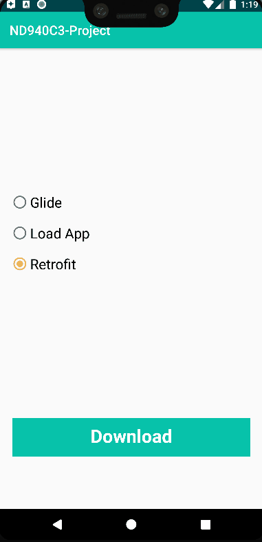

This project is part of the [Andrlid Kotlin Developer Nanodegree](https://vtsen.hashnode.dev/is-it-worth-to-pay-for-android-kotlin-developer-nanodegree) from Udacity. For details, please refer to the following:
- [Course 3 Project: Design an App with Application Loading Status](https://vtsen.hashnode.dev/android-kotlin-developer-nanodegree-projects-review#heading-course-3-project-design-an-app-with-application-loading-status)

## Requirements
- Android Studio Bumblebee or later
